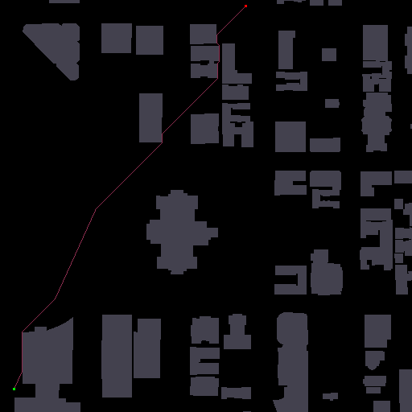

## A_star
Реализация алгоритма А*.

Добавлена визуализация найденного пути и график.


## Использование

Пока красивая реализация входных данных немного страдает, но вот, что можно делать на текущий момент:

* В файле ```main.py``` вы можете указать название карты ( я брала с [movingai](https://movingai.com/benchmarks/street/index.html) ), координаты начальной и конечной точки. 
```Node.Cut_corners``` отвечает за срезание углов. При выставлении ```True```, алгоритм не будет срезать углы.
На выходе вы получаете файл ```path.txt```, где будет вся информация: координаты начала и конца, сам путь и его стоимость.
* Если вы хотите получить визуализированный результат работы алгоритма в формате .png, то необходимо запустить ```image.py```, на выходе вы получите файл ```path.png```.



* ```test.py``` отвечает за тесты с ```movingai```.
 
## Характеристики
Все графики будут реализованы в Jupyter Notebook, на данный момент представлен только график зависимости времени работы алгоритма от стоимости пути для A*


Видно, что зависимость линейная

## План работ
* Реализовать ARA*
* Настроить удобную работу со скриптами
* Сделать информативный Jupyter Notebook
