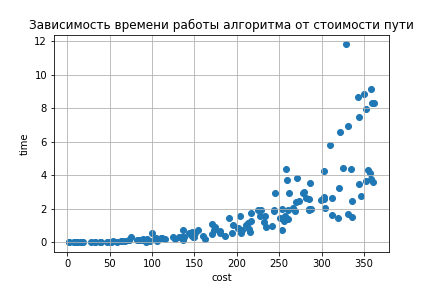

## A_star
Реализация алгоритма А*.

Добавлена визуализация найденного пути и график.


## Использование


* В файле ```main.py``` вы можете указать название карты ( я брала с [movingai](https://movingai.com/benchmarks/street/index.html) ), координаты начальной и конечной точки. 

```Node.Cut_corners``` отвечает за срезание углов. При выставлении ```True```, алгоритм не будет срезать углы.
На выходе вы получаете файл ```path.txt```, где будет вся информация: координаты начала и конца, сам путь и его стоимость.

Вы также можете задать эвристическую функцию, которую хотите использовать для работы с алгоритмом: одно из значений  ```'Euclid', 'Chebyshev', 'Octile'``` нужно передать третьим аргументом в функцию ```astar.search()```
* Если вы хотите получить визуализированный результат работы алгоритма в формате .png, то необходимо запустить ```image.py```, на выходе вы получите файл ```path.png```.


* ```test.py``` отвечает за тесты с ```movingai```.
 
## Характеристики




